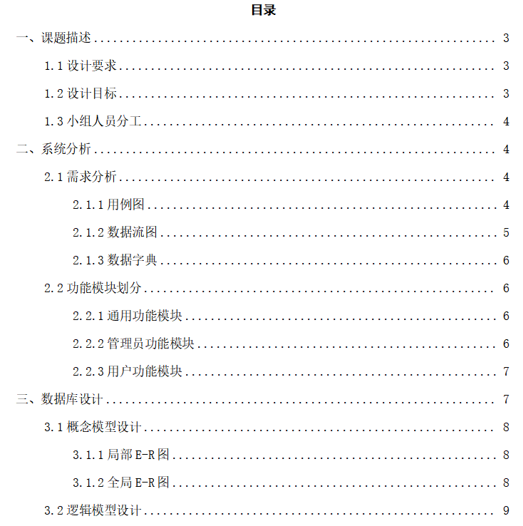
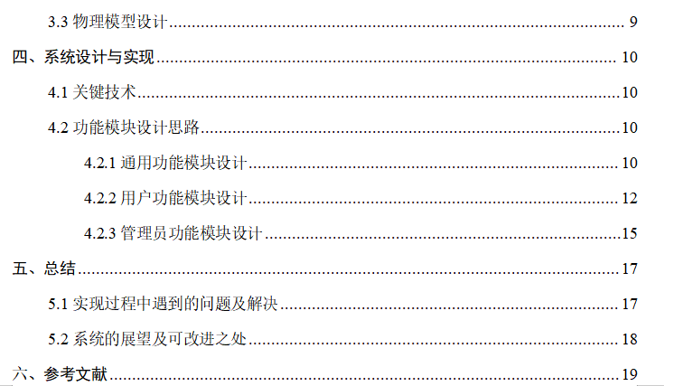

# 乐享图书

## 介绍

基于 Java Web 实现的基于Java Web实现的图书管理平台，具体功能如下：

- 实现图书类别、期刊类别、出版社等基本信息管理。
- 实现图书信息、期刊信息、读者信息管理。
- 实现借阅、归还、零售管理。
- 借阅或归还时自动修改图书或期刊的在册数量，零售时修改图书或期刊的总量和在册数量（用触发器实现）。
- 创建存储过程统计指定时间段内各种图书、期刊的借阅、零售数量。
- 创建存储过程统计指定客户借阅、购买情况（书名（刊物名）、数量）。
- 创建check约束限制图书、期刊的单位为‘本’。

**详细的系统分析、数据库设计、系统设计与实现可查看乐享图书-说明文档。**

