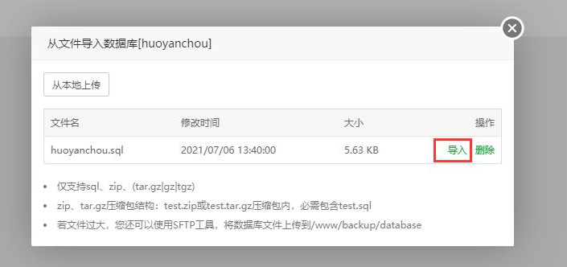

# Java项目云上部署

## 配置服务器并远程连接

1. 进入到控制台，我们看到服务器的状态还在转圈则继续等待
2. 点击“更多”–“管理”

3. 进来之后，看到“远程登录”我们点击

4. 一开始创建好之后是没有密码的，我们需要自己重置一下密码，点击“重置密码”

5. 重置的密码有硬性要求，必须包含大小写、必须包含数字、必须包含特殊符号、必须 12位以上；设置好之后点击“下一步”
6. 勾选“统一强制关机”-- “重置密码”
7. 复制一下 IP，我们开始连接服务器
8. 打开我们的连接软件，添加我们要连接的服务器，选择SSH连接(Linux 连接端口为 22)

## 安装宝塔并开放端口

1. 百度搜索“宝塔”并选择 Linux 版本，点击“立即安装”
2. 找到 Linux 安装命令，Centos 系统的安装命令

3. 安装成功后会给出访问地址、用户名和密码。

   这个时候我们还进不去，我们需要查看服务器是否开放了面板的 8888 端口

4. 回到控制台 点击“防火墙”查看是否有我们想要的 8888 端口，没有的话 点击“添加规则”进行添加

5. 我们需要创建新的规则，在端口出输入想要开放的端口，我们这里输入 8888，建议添加上备注，方便以后阅读

6. 添加成功之后即可访问宝塔面板，输入之前的用户名与密码即可登录

## 安装搭建环境

1. 登录宝塔账号，如果没有账号，点击注册，注册完毕之后建议安装LNMP环境

2. 选择“软件商店”，搜索栏搜索“java”-- 找到“**Java** **项目管理器**”

   `这里注意，不是项目一键部署！一键部署是针对SpringCloud使用的`

   点击安装 Java 项目管理器（适用于 Spring MVC 和 纯 Servlet 项目）

3. 安装完成之后 点击“设置”，点击“版本管理”-- 下拉选择“tomcat8”（根据生产环境来选择）

4. 等待安装完毕即可

## 部署项目

1. 选择“项目管理”-- “添加项目”

2、项目域名，**没有域名的话填 ip 也是可以的**

想要用域名访问的话需要自己去买、买完之后经过实名、ICP 备案、等待审核（腾讯云一个月）。审核完之后就可以使用了。

由于没有域名，只有一个 ip，一个项目的话建议使用 8080，多个项目的话建议避开默认端口，
被占用的默认端口：Tomcat7 (8081) Tomcat8 (8082) Tomcat9 (8083)

这边随便写了一个 8900

3. 在服务器上添加一个数据库

4. 从本地上传电脑导出的 sql 文件

5. 不要忘记更改项目中连接 MySQL 数据库的配置，在左侧栏目“数据库”里面可以看到自己创建在服务器的数据库，复制用户名密码

替换掉配置文件的生产环境的用户名密码

6. 在idea中导出 War 包，找到项目目录，点击进去

7. 把刚才生成的 war 包上传到根目录并解压

8. 解压完毕，在 java 项目管理器中点击“映射”，将项目映射在公网上

9. 再次进入项目目录，删除自动生成的 index.html 文件。它的访问权重比较高，它存在的话会默认进入 index.html

10. 还没有对 8900 项目端口进行开放，在“服务器控制台” – “防火墙” – “添加规则” 对项目端口进行放行

11.输入网址+端口即可访问我们的项目，至此完成Java项目云上部署