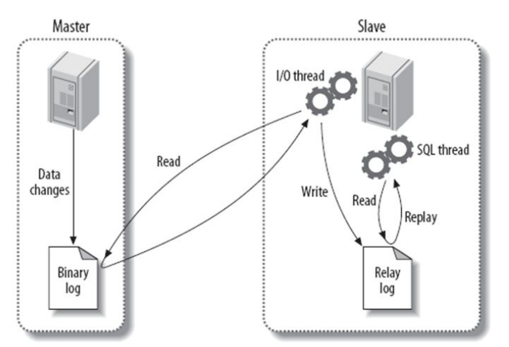

# MySQL的优化

## **错误日志（log_error）**

错误日志是用来记录MySQL数据库的启动、关闭、日常运行过程中、状态信息、警告、错误等信息

- 查看错误日志文件位置

```bash
MariaDB [(none)]> show variables like 'log_error'; 
+---------------+------------------------------+ 
| Variable_name | Value | 
+---------------+------------------------------+ 
| log_error | /var/log/mariadb/mariadb.log |
+---------------+------------------------------+
1 row in set (0.00 sec)
```

## **二进制日志（binlog）**

备份恢复必须依赖二进制日志，主从环境必须依赖二进制日志。binlog是SQL层的功能，记录的是变更的sql语句，不记录查询语句。

- 开启二进制日志

```bash
vim /etc/my.cnf 
server_id=6 # 设置id 
log_bin=mysql-bin # 开启并指定二进制日志目录及前缀名，记得关闭selinux 
binlog_format=row # binlog 的日志记录格式 
修改完配置重启服务会自动生成二进制日志
```

- 日志记录方式
  - SBR(statement based replication) ：语句模式原封不动的记录当前DML，5.6默认。
  - RBR(ROW based replication) ：记录数据行的变化(用户看不懂，需要工具分析)，5.7默认。
  - mixed（混合）MBR(mixed based replication)模式 ：以上两种模式的混合

- SBR模式与RBR模式的对比（面试题）
  - SBR：可读性较高，日志量少，但是不够严谨
  - ROW：可读性很低，日志量大，足够严谨（建议使用）

- event事件简介

```bash
二进制日志的最小记录单元 
对于DDL,DCL,一个语句就是一个event 
对于DML语句来讲:只记录已提交的事务。 
例如以下列子,就被分为了4个event 
begin; 120 - 340 
DML1 340 - 460 
DML2 460 - 550 
commit; 550 - 760
```

- 查看日志的开启情况

```bash
MariaDB [(none)]> show variables like '%log_bin%';
+---------------------------------+-------+
| Variable_name                   | Value |
+---------------------------------+-------+
| log_bin                         | ON    |
| log_bin_trust_function_creators | OFF   |
| sql_log_bin                     | ON    |
+---------------------------------+-------+
3 rows in set (0.00 sec)
```

- 查看二进制日志文件数量

```bash
MariaDB [(none)]> show binary logs;
+------------------+-----------+
| Log_name         | File_size |
+------------------+-----------+
| mysql-bin.000001 |       245 |
+------------------+-----------+
1 row in set (0.00 sec)

MariaDB [(none)]>flush logs; 
Query OK, 0 rows affected (0.03 sec) 
MariaDB [(none)]>flush logs;
Query OK, 0 rows affected (0.01 sec)
MariaDB [(none)]>show binary logs;
+------------------+-----------+ 
| Log_name 			| File_size |
+------------------+-----------+ 
| mysql-bin.000001 	| 201 | 
| mysql-bin.000002 	| 201 | 
| mysql-bin.000003 	| 154 | 
+------------------+-----------+
3 rows in set (0.00 sec)
```

- 查看正在使用的二进制日志文件

```bash
MariaDB [(none)]> show master status;
+------------------+----------+--------------+------------------+
| File             | Position | Binlog_Do_DB | Binlog_Ignore_DB |
+------------------+----------+--------------+------------------+
| mysql-bin.000001 |      245 |              |                  |
+------------------+----------+--------------+------------------+
1 row in set (0.00 sec)
```

- 日志内容查看

```bash
MariaDB [(none)]> show binlog events in 'mysql-bin.000001';
+------------------+-----+-------------+-----------+-------------+-------------------------------------------+
| Log_name         | Pos | Event_type  | Server_id | End_log_pos | Info                                      |
+------------------+-----+-------------+-----------+-------------+-------------------------------------------+
| mysql-bin.000001 |   4 | Format_desc |         6 |         245 | Server ver: 5.5.68-MariaDB, Binlog ver: 4 |
+------------------+-----+-------------+-----------+-------------+-------------------------------------------+
1 row in set (0.00 sec)

Log_name：binlog文件名 
Pos：开始的position *****
Event_type：事件类型 
Format_desc：格式描述，每一个日志文件的第一个事件，多用户没有意义，MySQL识别binlog必要信息
Server_id：mysql服务号标识
End_log_pos：事件的结束位置号 ***** 
Info：事件内容***** 
补充:
SHOW BINLOG EVENTS 
		[IN 'log_name'] 
		[FROM pos] 
		[LIMIT [offset,] row_count]
```

- binlog内容详细查看

```bash
[root@localhost ~]# mysqlbinlog --base64-output=decode-rows -vvv /data/binlog/mysql-bin.000001
```

- 基于position进行二进制日志截取

```bash
[root@localhost ~]# mysqlbinlog --start-position=219 --stop-position=1347 /data/binlog/mysql-bin.000003 >/tmp/bin.sql
```

## **慢日志slow_log**

慢日志文件是记录运行比较慢的sql语句，将这些sql语句记录下来以便进一步优化。可以自行补充一些关于慢日志的分析。

- 修改配置文件开启慢日志

```sql
开关: 
slow_query_log=1 
文件位置及名字 
slow_query_log_file=/data/mysql/slow.log 
设定慢查询时间: 
long_query_time=0.1 
没走索引的语句也记录: 
log_queries_not_using_indexes=1 
[root@localhost ~]# vim /etc/my.cnf 
	slow_query_log=1 
	slow_query_log_file=/data/mysql/slow.log 
	long_query_time=0.1 
	log_queries_not_using_indexes=1 
[root@localhost ~]# systemctl restart mysqld
```

## 使用mysqldump工具备份

- mysqldump备份数据库的原理是把数据（包括库表）从MySQL库里以sql语句的形式直接输出或者生产备份文件的过程，这种备份成sql的方式称为逻辑备份。


- 不带参数备份单个数据库

```bash
[root@localhost ~]# mysqldump test > test_db_bak.sql 
# 可以打开看看备份的数据 
[root@localhost ~]# cat test_db_bak.sql | grep -Ev "#|\*|--|^$" DROP TABLE IF EXISTS `test_tb`; 
CREATE TABLE `test_tb` ( 
	`id` int(11) DEFAULT NULL, 
	`name` char(20) DEFAULT NULL 
) ENGINE=InnoDB DEFAULT CHARSET=gb2312; 
LOCK TABLES `test_tb` WRITE; 
INSERT INTO `test_tb` VALUES (1,'??'),(2,'lisi'),(4,'尼古拉赵四'),(3,'王二麻'), (5,'谢大脚'),(6,'谢广坤'); 
UNLOCK TABLES;
```

- 加-B参数备份多个数据库
  - 加-B参数的作用是增加创建数据库和连接数据库的语句，后面可以直接接多个库名，同时备份多个数据库

```bash
使用-B参数备份的数据会增加两行语句 
CREATE DATABASE /*!32312 IF NOT EXISTS*/ `test` /*!40100 DEFAULT CHARACTER SET gbk */;
USE `test`;
```

- 使用gzip压缩备份数据

```bash
[root@localhost ~]# mysqldump -B test | gzip> test_db_bak.sql.gz 
[root@localhost ~]# ll -h 
总用量 12K 
-rw-------. 1 root root 1.4K 12月 2 15:04 anaconda-ks.cfg 
-rw-r--r--. 1 root root 2.1K 12月 3 23:33 test_db_bak.sql 
-rw-r--r--. 1 root root 824 12月 3 23:38 test_db_bak.sql.gz
```

- 备份多个表或者多个表

```bash
# 备份单个表 
mysqldump 数据库名 表名 > 备份文件名

# 备份多个表
mysqldump 数据库名 表名1 表名2 … > 备份文件名
```

## **恢复**

- 将sql语句重新执行一遍，则完成数据恢复
- 可以选择在客户端使用客户端工具运行sql脚本

```sql
mysql < db.sql

source /root/db.sql
```

- 可以在数据库服务器里面执行source命令；

# 主从复制原理

## 复制过程

1. 主服务器上任何的更新操作会被写入到二进制日志文件中

2. 从服务器上的IO线程：

3. 检测主服务器的二进制日志文件的变化

4. 同步主服务器的二进制日志文件到本地的中继日志中

5. 从服务器上的sql线程负责读取和执行中继日志中的sql语句



## 主库相关操作

- 修改配置文件

```bash
[root@server2 ~]# vim /etc/my.cnf 
[mysqld]
......
server_id =1 
log_bin=mysql-bin 
...... 
[root@server2 ~]# systemctl restart mariadb.service
```

- 创建主从复制用户

```bash
# mysql_secure_installation
[root@server2 ~]# mysql -uroot -p1 
MariaDB [(none)]> grant replication slave on *.* to rep@'192.168.150.%' identified by '123456'
```

- 记录主库位置点

```bash
MariaDB [(none)]> show master status; 
+------------------+----------+--------------+------------------+ 
| File | Position | Binlog_Do_DB | Binlog_Ignore_DB |
+------------------+----------+--------------+------------------+ 
| mysql-bin.000001 | 395 | | | 
+------------------+----------+--------------+------------------+ 
1 row in set (0.00 sec)
```

## 从库相关操作

- 修改从库配置文件

```bash
[root@server3 ~]# cat /etc/my.cnf 
...... 
server_id =5 
...... 
[root@server3 ~]# systemctl restart mariadb.service
```

- 从库开始连接主库

```bash
MariaDB [(none)]> change master to master_host='192.168.80.129',master_port=3306,master_user='rep',master_passw ord='123456',master_log_file='mysql-bin.000001',master_log_pos=395; 
Query OK, 0 rows affected (0.00 sec)

MariaDB [(none)]> start slave; 
Query OK, 0 rows affected (0.01 sec) 

MariaDB [(none)]> show slave status\G; 
*************************** 1. row *************************** 
					Slave_IO_State: Waiting for master to send event 
					......
					Slave_IO_Running: Yes 
					Slave_SQL_Running: Yes 
					......
```

- 验证结果

```bash
# 在主库上建库 
MariaDB [(none)]> create database db1;
Query OK, 1 row affected (0.00 sec) 

# 在从库上查库 
MariaDB [(none)]> show databases; 
+--------------------+ 
| Database 			 | 
+--------------------+ 
| information_schema |
| db1 				 |
| mysql 			 |
| performance_schema | 
+--------------------+
```

